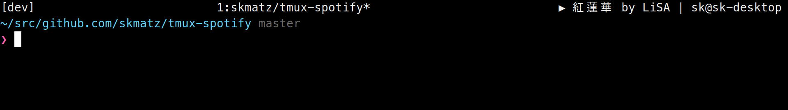

# tmux-spotify

`tmux-spotify` is a [tmux](https://github.com/tmux/tmux) plugin to display Spotify information in the status bar **for Linux**.



This application extracts the Spotify information via DBus (without Spotify API).  
Also, compared to the original implementation ([pwittchen/tmux-plugin-spotify](https://github.com/pwittchen/tmux-plugin-spotify)), there is no need to globally install the Spotify CLI written in Python, nor is there any need to install DBus-related libraries.

## Requirements

First, install the CLI to extract Spotify information via DBus from [GitHub Releases](https://github.com/skmatz/tmux-spotify/releases) and put it in a directory in your `$PATH`.

## Installation

Once that's done, install the tmux plugin.

### TPM

It is recommended to use [TPM](https://github.com/tmux-plugins/tpm), which is a plugin manager for tmux.

```tmux
set -g @plugin "skmatz/tmux-spotify"
```

Hit <kbd>Prefix</kbd> + <kbd>I</kbd> to fetch and source.

### Manually

Or, you can install manually.

Clone the repository.

```bash
git clone https://github.com/skmatz/tmux-spotify ~/.tmux/plugins/tmux-spotify
```

Add this line to your `.tmux.conf`.

```tmux
run-shell ~/.tmux/plugins/tmux-spotify.tmux
```

Reload tmux.

```bash
tmux source-file ~/.tmux.conf
```

## Usage

Add the following command to the `status-left` or `status-right` in your `.tmux.conf`.

```tmux
set -g status-right "#{spotify_title}"
```

You can also set more options.

- `spotify_album`
- `spotify_album_artist`
- `spotify_artist`
- `spotify_status`
- `spotify_status_icon`
- `spotify_title`

## Configurations

```tmux
set -g @spotify_icon_paused "▮▮"
set -g @spotify_icon_playing "▶"
set -g @spotify_icon_stopped "■"
```

## References

- [pwittchen/tmux-plugin-spotify](https://github.com/pwittchen/tmux-plugin-spotify)
